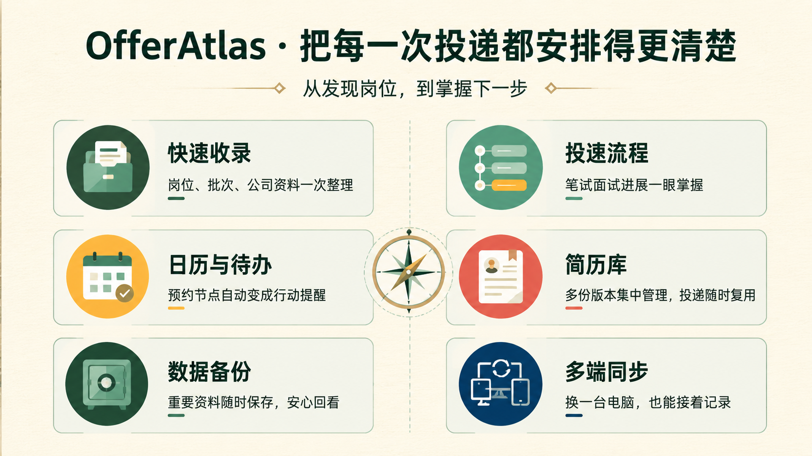
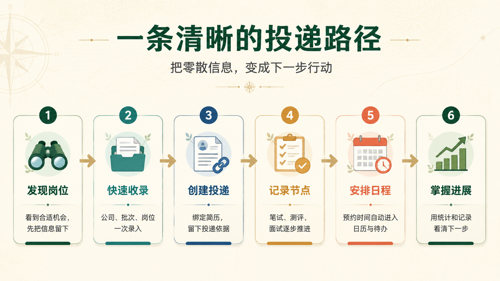

# OfferAtlas

> Windows 求职投递管理工具

把岗位线索、投递记录、笔试面试、简历和资料集中到一处。无论是刚发现心仪岗位，还是在多轮流程中安排日程、回看进展，都能清楚知道下一步该做什么。

[下载最新版](https://github.com/dingyu123456/offer-atlas/releases/latest) · [快速上手](docs/offer-atlas-quick-start.md) · [云同步指南](docs/cloud-sync-guide-zh.md)



## 从岗位到 Offer

| 你正在做什么 | OfferAtlas 如何帮助你 |
| --- | --- |
| 发现新岗位 | 通过“快速收录”一次保存公司、招聘批次和岗位信息；已有资料会自动复用，JD、公告截图和其他文件也可以随岗位保存。 |
| 开始投递 | 把岗位与实际投递分开管理，记录投递时间、渠道和所用简历版本；同一份简历可复用于多条投递。 |
| 追踪真实流程 | 按笔试、测评、一面、二面、HR 面、Offer 等节点记录每一次进展，不必预设不可靠的固定流程。 |
| 安排笔试和面试 | 为已预约节点填写时间后，日历和待办会自动汇总；点击即可回到对应投递查看完整上下文。 |
| 回看秋招进展 | 总览集中展示投递数量、笔试与测评、各轮面试推进和 Offer 状态；统计数字可直接跳转到对应记录。 |
| 切换电脑继续使用 | 连接自己的 Gitee 账号后，岗位、投递、附件和简历可在多台 Windows 电脑间自动同步，也可随时手动同步。 |
| 需要安心整理数据 | 完整备份支持恢复；投递镜像可直接用 Excel、WPS 或 LibreOffice 查看，方便留存或分享。 |

## 一条清晰的投递路径

OfferAtlas 将一次求职过程拆成几个自然步骤：先留下岗位信息，再绑定投递和简历，持续记录节点，最后用日历、待办和统计掌握下一步。



## 使用教程

建议首次使用时先阅读下面两份教程。它们面向实际使用者，按应用中的真实功能说明操作步骤和注意事项：

- [OfferAtlas 快速上手](docs/offer-atlas-quick-start.md)：从录入公司、招聘批次和岗位开始，介绍投递记录、流程节点、日历、待办、简历库以及数据备份等核心功能。
- [Gitee 云同步使用指南](docs/cloud-sync-guide-zh.md)：介绍如何连接 Gitee、完成首次上传或下载、在多台电脑间同步，以及查看同步状态、处理失败和冲突。

如果只想先了解日常使用流程，请从“快速上手”开始；准备在多台电脑之间使用时，再阅读“Gitee 云同步使用指南”。

## 产品设计

[查看产品架构、状态规则与流程节点说明](docs/product-overview-zh.html)。这是一份独立的静态 HTML，不依赖应用运行环境、截图或网络，双击即可在普通浏览器打开。

## 开发

环境要求：Go 1.25+、Node.js 24+、Wails v2。

```powershell
go install github.com/wailsapp/wails/v2/cmd/wails@latest
cd frontend
npm install
cd ..
wails dev
```

## 验证与打包

```powershell
cd D:\Project\Go_Project\offer-atlas
go test ./...
go vet ./...
wails build -platform windows/amd64
```

Windows 可执行文件输出到 `build\bin\OfferAtlas.exe`。
