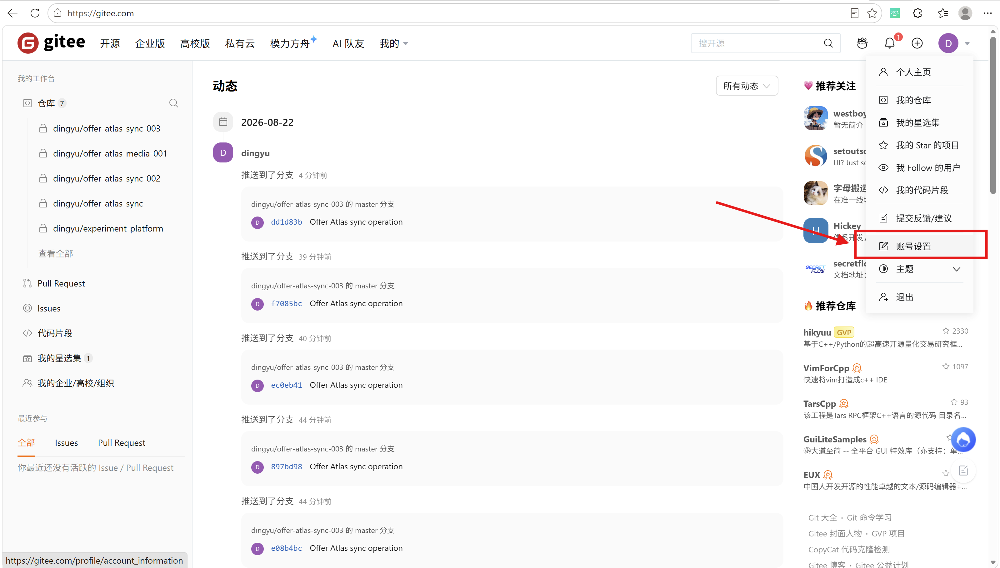
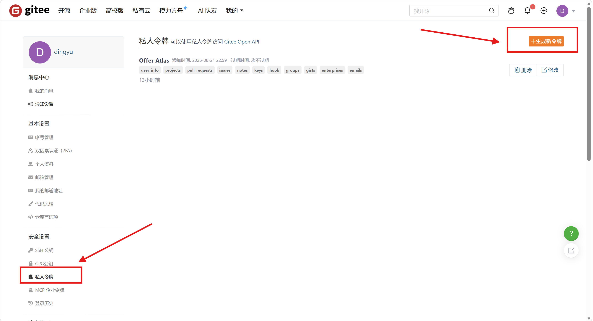
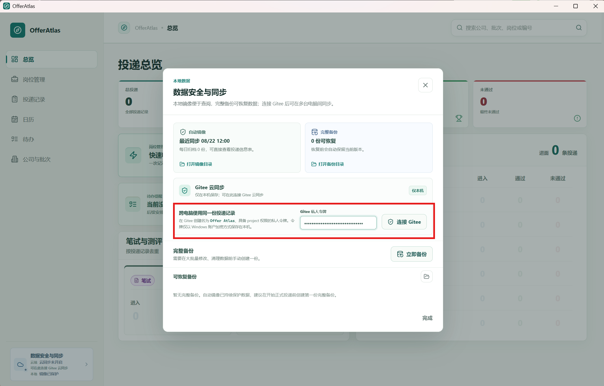
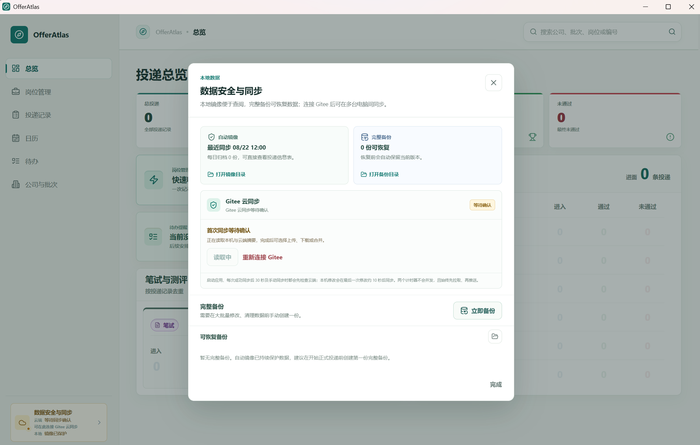
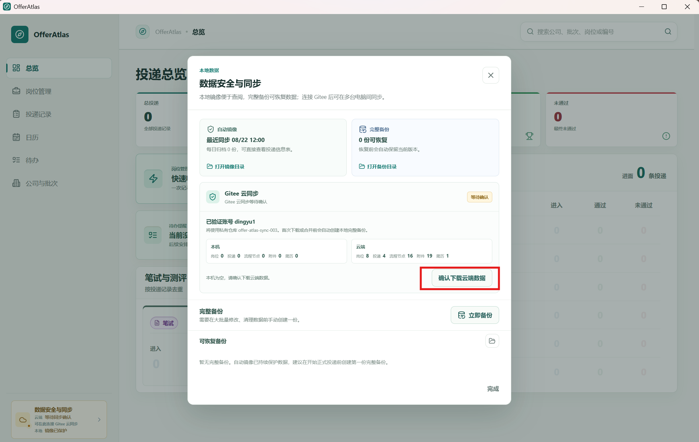

# Gitee 云同步使用指南

Offer Atlas 默认以本机保存数据。连接 Gitee 后，可以在多台 Windows 电脑之间继续使用同一份岗位、投递记录、流程节点和附件。

云同步不是必须开启的功能。未连接 Gitee 时，应用仍可完整地以单机模式使用。

## 开始使用

1. 打开左下角的“数据安全与同步”。

2. 在 Gitee 创建一个名为 `Offer Atlas`、拥有 `project` 权限的私人令牌。

   [工作台 - Gitee.com](https://gitee.com/)

   

   点击右上角头像，选择账号设置

   

   

   点击私人令牌

   点击右上角生成新令牌

   

   

   填写令牌描述（建议填Offer Atlas）和令牌过期时间之后提交即可，提交之后复制token==（建议在备忘录里记下来，后面在其他设备上使用）==。

   

   

3. 将令牌粘贴到“Gitee 云同步”区域并连接，状态变为等待确认，需要等待10s左右。

到这个状态时稍等几秒：

4. 首次连接时查看本机与云端摘要，再选择一种方式：

- **上传本机数据**：用本机记录建立云端数据。
- **下载云端数据**：将云端记录下载到本机。
- **合并两端数据**：保留两边各自的数据，并处理少数版本冲突。

下载或合并前，应用会先自动创建一份本地完整备份。首次确认不会自动覆盖本机数据。

令牌只保存在当前电脑的安全存储中，不会进入数据库、Excel 镜像、完整备份或云端同步记录。断开 Gitee 只会关闭本机同步，不会删除本地数据或远端仓库。

## 删除云端仓库

如果云端仓库需要重新建立，可在“数据安全与同步”中点击“删除云端仓库”。应用会先创建一份本地完整备份，再删除带有 Offer Atlas 标识的私有主仓库和附件仓库，最后断开本机同步。

这是不可逆操作：云端仓库删除后无法从 Gitee 恢复；本机数据库、岗位附件、投递简历和本地备份不会被删除。普通同名仓库没有 Offer Atlas 标识时不会被误删。删除完成后，如需继续云同步，可重新连接 Gitee 并选择上传本机数据。

## 自动同步

### 本地修改后的自动上传

每次保存公司、招聘批次、岗位、投递记录、流程节点或附件后，数据会先立即保存到本机，然后进入待同步状态。

- 第一次修改会开启一个约 **10 秒**的同步窗口。
- 窗口内的后续修改会立即保存并加入本轮同步。
- 这不会启动多轮并行同步；同一对象在等待期间的多次修改会按顺序在这一轮同步中处理。
- 如果当前同步还没有结束，期间的新修改会进入下一批，不会覆盖或丢失。
- 当前同步成功后，下一批修改才开始新的约 10 秒等待。

### 自动检查云端更新

自动检查用于发现其他电脑上的新记录：

- 应用启动并完成连接后，会立即检查一次云端。
- 每次检查或同步成功后，等待约 **30 秒**再进行下一次检查。
- 检查和上传严格排队，同一时间只执行一个同步任务，顺序始终是“先读取云端，再上传本机修改”。
- 每次传输前都会先读取云端兼容性声明；网络暂时不可用时会先短重试，确认失败前不会读取操作日志、下载附件或上传本地记录。
- 云端数据拉取完成后，当前打开的列表、总览、日历、待办和详情会自动刷新，无需切换页面。

因此，另一台电脑完成修改后，通常会在下一次云端检查时被发现；当前电脑无需切换页面或重新打开应用。

## 手动同步

在“数据安全与同步”中点击“立即同步”，会马上执行一次同步，不等待 10 秒或 30 秒计时器。

手动同步同样会先检查云端，再上传本机尚未同步的修改。适合在切换电脑前、准备关闭应用前，或希望立即确认云端状态时使用。

## 关闭应用时

如果存在待同步修改，或同步任务正在进行，关闭应用后会进入“正在安全退出”状态：

- 应用会等待同步完成后自动关闭。
- 不提供跳过同步直接关闭的选项，避免刚保存的数据尚未送达云端。
- 如果同步持续失败，应用会保持打开，并提示检查网络、令牌权限或仓库容量。

## 失败与重试

遇到临时网络或 Gitee 服务问题时，应用会自动进行几次短重试：

1. 第一次失败后约 2 秒重试。
2. 再次失败后约 5 秒重试。
3. 仍失败时约 12 秒后进行最后一次重试。

三次重试仍未成功时，界面会显示失败原因。本地修改仍会保留，下一次本地修改、手动同步或应用启动时会再次尝试。

多次失败后会显示“本地数据已保存，云同步未完成”。这表示本机数据仍然安全保存，只是本次没有完成云端同步。之后可以点击“立即同步”、重新进行本地修改，或重新打开应用再次尝试。

令牌失效、权限不足和云端容量不足等问题，需要先处理对应问题，再重新同步。

## 同步状态

| 状态 | 含义 |
| --- | --- |
| 仅本机 | 尚未连接 Gitee，数据只保存在当前电脑。 |
| 待同步 | 本机有已保存、等待上传的修改。 |
| 检查云端 | 正在读取其他电脑的更新。 |
| 确认兼容性 | 正在确认当前版本是否满足云端最低要求；此时尚未传输业务数据。 |
| 同步中 | 正在处理本机修改或下载云端数据。 |
| 已同步 | 本机与云端最近一次检查已完成。 |
| 等待确认 | 首次接入尚未选择上传、下载或合并。 |
| 需要处理冲突 | 两端对同一对象产生了无法自动判断的不同修改。 |
| 同步失败 | 本地数据已保存，但本次云端操作未完成。 |
| 云端未确认 | 暂时无法读取云端兼容性声明；本次未传输任何数据。 |
| 需要更新 | 云端最低兼容版本或能力高于当前版本；更新前不会进行同步。 |

## 冲突怎么处理

不同电脑修改不同公司、岗位或投递记录时，应用会自动合并。

只有在两台电脑同时基于同一个旧版本修改了同一个对象，或一台电脑删除、另一台电脑修改了同一对象时，才需要处理冲突。冲突区域会展示本机与云端的摘要，并提供：

- **保留本机**
- **使用云端**

选择完成后，应用会生成一次新的同步记录，不会静默覆盖另一边的数据。

## 使用建议

- 第一次在新电脑使用时，先等待“本机与云端摘要”读取完成，再确认下载或合并。
- 离开一台电脑前，等待状态变为“已同步”，或点击一次“立即同步”。
- 定期在“数据安全与同步”中创建完整备份。云同步适合多设备使用，完整备份适合在本机恢复数据。
- 岗位附件和投递简历也会同步，受 Gitee 账号总容量5G和单文件50M大小限制，对于投递管理完全够用。
